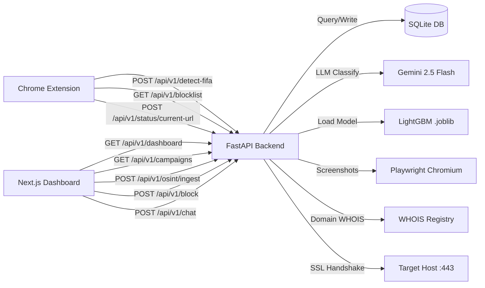
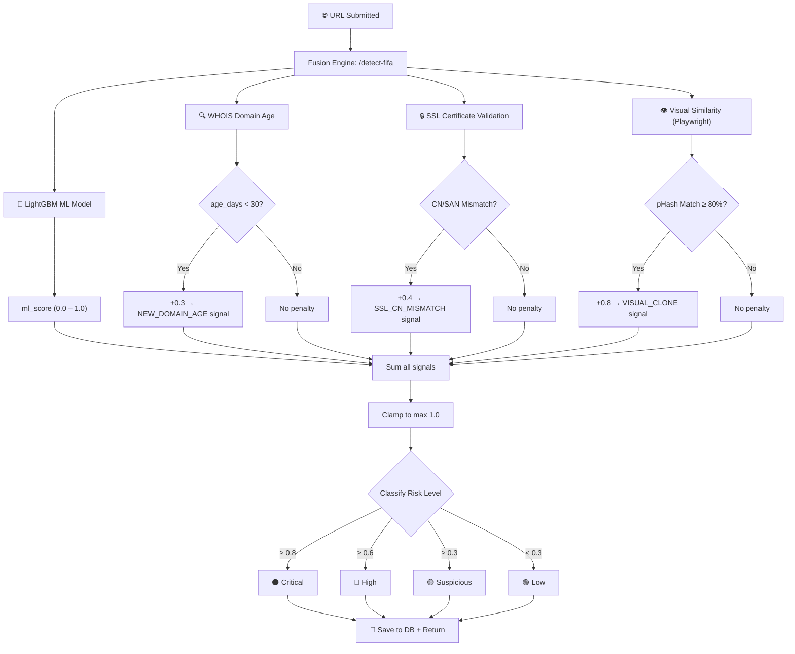
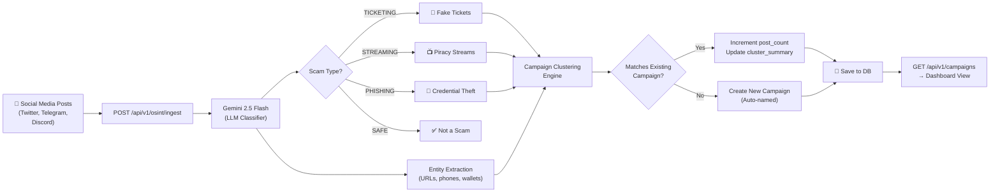
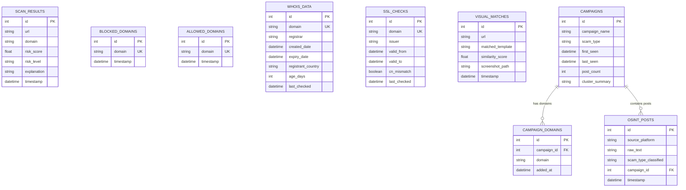

<p align="center">
  
  
  
  
  
  
  
</p>

<h1 align="center">⚽🛡️ FIFA Threat Intelligence Platform</h1>
<h3 align="center">AI-Powered Scam, Fraud & Piracy Detection for the FIFA Ecosystem</h3>

<p align="center">
  <i>A multi-layered real-time threat intelligence platform that fuses Machine Learning, Domain Intelligence (WHOIS/SSL), Visual Cloned-Page Detection, and OSINT Campaign Clustering to protect fans, ticketing systems, and broadcast integrity during FIFA events.</i>
</p>

<p align="center">
  <b>Track 3: Cybersecurity | Problem Statement 7</b>
</p>

---

## 📋 Table of Contents

- [Overview](#-overview)
- [Key Features](#-key-features)
- [System Architecture](#-system-architecture)
- [Detection Pipeline — The Fusion Engine](#-detection-pipeline--the-fusion-engine)
- [Project Structure](#-project-structure)
- [ML Model — Performance & Metrics](#-ml-model--performance--metrics)
- [Feature Engineering (30 URL Features)](#-feature-engineering-30-url-features)
- [The 4 Intelligence Modules (Novel Work)](#-the-4-intelligence-modules-novel-work)
- [OSINT Pipeline & Campaign Clustering](#-osint-pipeline--campaign-clustering)
- [API Reference](#-api-reference)
- [Database Schema](#%EF%B8%8F-database-schema)
- [Quick Start Guide](#-quick-start-guide)
- [Tech Stack](#-tech-stack)
- [What's Reused vs. What's New](#-whats-reused-vs-whats-new)
- [Troubleshooting](#-troubleshooting)
- [Future Roadmap](#-future-roadmap)
- [License](#-license)

---

## 🌐 Overview

The FIFA ecosystem — tournament ticketing, fan engagement, live broadcasts — is a high-value target for cybercriminals. Fake ticketing portals steal money and credentials, scam campaigns spread via social media and messaging apps, illegal live-stream sites offer unauthorized match broadcasts, and malware drops are disguised as official FIFA services.

**FIFA Threat Intel** is a **full-stack AI security platform** purpose-built to detect, score, and visualize these threats in near real-time. It operates across three integrated components:

| Component | Technology | Role |
|-----------|-----------|------|
| **Backend API** | FastAPI + LightGBM + Gemini LLM | ML inference, domain intelligence, visual similarity, OSINT classification |
| **Dashboard** | Next.js 16 + React 19 + TailwindCSS | Activity monitoring, campaign visualization, AI assistant |
| **Browser Extension** | Chrome Extension (Manifest V3) | Real-time URL scanning, badge overlay, active domain blocking |

### Risk Scoring System

| Badge | Score Range | Meaning |
|-------|------------|---------|
| 🟢 **Green** | 0.0 – 0.29 | Low risk — safe to browse |
| 🟡 **Yellow** | 0.30 – 0.59 | Suspicious — proceed with caution |
| 🔴 **Red** | 0.60 – 0.79 | High risk — likely malicious |
| ⚫ **Critical** | 0.80 – 1.0 | Critical threat — actively blocked |

---

## ✨ Key Features

### For FIFA Security Teams
- ✅ **Unified Threat Score**: Fuses ML, WHOIS domain age, SSL certificate mismatch, and visual clone detection into a single actionable `fusion_score`
- ✅ **OSINT Campaign Clustering**: Groups scam posts from social media / Telegram / Discord into unified threat campaigns using Gemini AI
- ✅ **Campaign Dashboard**: Track active scam operations (ticketing fraud, piracy streams, phishing waves) with entity extraction
- ✅ **Threat Signal Breakdown**: Every score is explainable — analysts see exactly which signals triggered (e.g., `NEW_DOMAIN_AGE_4`, `SSL_CN_MISMATCH`, `VISUAL_CLONE_login_page.png`)

### For End Users
- ✅ Real-time phishing detection badges on **search results** (Google, Brave, Bing)
- ✅ Automatic blocking of high-risk sites (≥75% risk score) with a custom interstitial page
- ✅ Interactive risk popup on hover showing detailed threat analysis
- ✅ DOM popup scanner for fake "virus detected" overlays
- ✅ Dialog interceptor for malicious `alert()`/`confirm()`/`prompt()` calls

### For Administrators
- ✅ Centralized dashboard with KPIs (total scans, threats blocked, safety score)
- ✅ 7-day activity trend charts
- ✅ Manual domain block/unblock with one click
- ✅ AI-powered chat assistant for security guidance
- ✅ REST API with OpenAPI/Swagger documentation at `/docs`

---

## 🏗 System Architecture

```
┌──────────────────────────────────────────────────────────────────────────────────┐
│                     FIFA Threat Intelligence Architecture                        │
├──────────────────────────────────────────────────────────────────────────────────┤
│                                                                                  │
│   ┌──────────────────────┐     HTTP/REST      ┌───────────────────────────────┐  │
│   │   Chrome Extension   │ ◄─────────────────►│       FastAPI Backend         │  │
│   │   (Manifest V3)      │    Port 8000       │       (Python 3.10+)          │  │
│   │                      │                    │                               │  │
│   │  ┌────────────────┐  │  /api/v1/          │  ┌─────────────────────────┐  │  │
│   │  │ Service Worker  │  │  detect-fifa       │  │   LightGBM ML Model    │  │  │
│   │  │ (Background)    │──│──────────────────►│  │   (30 Features)         │  │  │
│   │  │  • URL Analysis │  │                    │  │   • 500K samples        │  │  │
│   │  │  • Cache (1hr)  │  │                    │  │   • AUC-ROC: 0.993      │  │  │
│   │  │  • Blocklist    │  │                    │  └─────────────────────────┘  │  │
│   │  │    Sync (4s)    │  │                    │                               │  │
│   │  └────────────────┘  │                    │  ┌─────────────────────────┐  │  │
│   │                      │                    │  │   FIFA Intelligence     │  │  │
│   │  ┌────────────────┐  │                    │  │  ┌───────────────────┐  │  │  │
│   │  │ Content Scripts │  │                    │  │  │  WHOIS Service    │  │  │  │
│   │  │  • Badge Inject │  │                    │  │  │  (Domain Age)     │  │  │  │
│   │  │  • Risk Popup   │  │                    │  │  ├───────────────────┤  │  │  │
│   │  │  • Dialog Hook  │  │                    │  │  │  SSL Validator    │  │  │  │
│   │  │  • DOM Scanner  │  │                    │  │  │  (CN/SAN Check)   │  │  │  │
│   │  └────────────────┘  │                    │  │  ├───────────────────┤  │  │  │
│   │                      │                    │  │  │  Visual Similarity │  │  │  │
│   │  ┌────────────────┐  │                    │  │  │  (Playwright+pHash)│  │  │  │
│   │  │ Popup UI       │  │                    │  │  ├───────────────────┤  │  │  │
│   │  │  • Stats View  │  │                    │  │  │  OSINT / Gemini   │  │  │  │
│   │  │  • Quick Scan  │  │                    │  │  │  (Campaign AI)    │  │  │  │
│   │  └────────────────┘  │                    │  │  └───────────────────┘  │  │  │
│   └──────────────────────┘                    │  └─────────────────────────┘  │  │
│                                               │                               │  │
│   ┌──────────────────────┐     HTTP/REST      │  ┌─────────────────────────┐  │  │
│   │   Next.js Dashboard  │ ◄─────────────────►│  │  SQLite Database        │  │  │
│   │   (React 19 + TS)    │    Port 3000       │  │   • scan_results        │  │  │
│   │                      │                    │  │   • blocked_domains      │  │  │
│   │  • KPI Dashboard     │                    │  │   • whois_data           │  │  │
│   │  • Campaign View     │                    │  │   • ssl_checks           │  │  │
│   │  • Activity Feed     │                    │  │   • visual_matches       │  │  │
│   │  • AI Chat Assistant │                    │  │   • campaigns            │  │  │
│   │  • Block/Unblock UI  │                    │  │   • osint_posts          │  │  │
│   └──────────────────────┘                    │  └─────────────────────────┘  │  │
│                                               └───────────────────────────────┘  │
└──────────────────────────────────────────────────────────────────────────────────┘
```

### Component Communication



---

## 🔄 Detection Pipeline — The Fusion Engine

The `/api/v1/detect-fifa` endpoint is the core of the platform. It combines **all intelligence signals** into a single risk score.



### Fusion Score Formula

```
fusion_score = min(1.0,
    ml_score                                          # Base: LightGBM probability
    + (0.3 if domain_age < 30 days)                   # WHOIS: newly registered
    + (0.4 if ssl_cn_mismatch == true)                # SSL: cert doesn't match domain
    + (0.8 if visual_similarity >= 80%)               # Visual: cloned FIFA page
)
```

### Base ML Score Blending (inside `/detect`)

The legacy `/detect` endpoint uses an **adaptive blending** strategy between ML and heuristics:

| ML Score Range | ML Weight | Heuristic Weight | Rationale |
|:-------------:|:---------:|:----------------:|-----------|
| ≥ 0.95 | 90% | 10% | ML is very confident |
| 0.50 – 0.95 | 70% | 30% | Moderate ML confidence |
| < 0.50 | 50% | 50% | Low ML confidence, rely on both |

```
final_score = (ml_weight × ml_score) + ((1 - ml_weight) × heuristic_score)
```

A **clean domain discount** (30–35% reduction) is applied to domains with legitimate TLDs (`.com`, `.org`, `.edu`, `.gov`) and reasonable structure (length 4–32 chars, ≤1 hyphen). Tranco Top 10K domains are capped at a max ML score of 0.20.

---

## 📁 Project Structure

```
football-hackathon/
│
├── backend/                              # 🐍 FastAPI Server (Fusion Detection Engine)
│   ├── main.py                           #   Core API (1092 lines) — all endpoints + detection pipeline
│   ├── requirements.txt                  #   Python dependencies (17 packages)
│   ├── app/
│   │   ├── database.py                   #   SQLAlchemy + SQLite config
│   │   ├── models.py                     #   ORM models (9 tables: ScanResult → Campaign → OsintPost)
│   │   └── services/
│   │       ├── whois_service.py          #   🆕 WHOIS domain age/registrar lookup
│   │       ├── ssl_check.py              #   🆕 SSL certificate validation (CN/SAN mismatch)
│   │       ├── visual_similarity.py      #   🆕 Playwright screenshot + pHash comparison
│   │       ├── osint_service.py          #   🆕 Gemini-powered OSINT post classification
│   │       ├── campaign_clustering.py    #   🆕 Entity-based campaign grouping engine
│   │       ├── impersonation.py          #   Brand impersonation + typosquatting detection
│   │       ├── temporal.py               #   Urgency tactic detection ("2 tickets left!")
│   │       ├── llm.py                    #   Gemini LLM integration (URL analysis + chat)
│   │       ├── inference.py              #   ML inference service
│   │       └── telemetry.py              #   Telemetry data collection
│   └── sql_app.db                        #   SQLite database (auto-generated)
│
├── my-app/                               # ⚛️ Next.js 16 Dashboard
│   ├── app/
│   │   ├── page.tsx                      #   Landing page (Hero + Features + ThreatMap)
│   │   ├── campaigns/page.tsx            #   🆕 OSINT Campaign visualization
│   │   ├── dashboard/                    #   Main monitoring dashboard
│   │   ├── analyze/                      #   Manual URL analysis page
│   │   ├── features/                     #   Feature showcase pages
│   │   ├── architecture/                 #   Architecture documentation page
│   │   ├── how-it-works/                 #   Technical explainer page
│   │   └── login/                        #   Authentication page
│   └── components/
│       ├── dashboard/                    #   Activity charts, KPI cards
│       ├── ai/                           #   AI chat assistant widget
│       ├── landing/                      #   Hero section, features, threat map, header
│       ├── features/                     #   Feature detail components
│       └── ui/                           #   Shared UI primitives (Radix UI)
│
├── extension-clean/                      # 🌐 Chrome Extension (Manifest V3)
│   ├── manifest.json                     #   Extension config (permissions, scripts)
│   ├── popup.html / popup.js             #   Extension popup UI (stats, scan button)
│   ├── blocked.html / blocked.js/.css    #   Custom interstitial block page
│   └── src/
│       ├── background/
│       │   └── service-worker.js         #   URL analysis, caching, blocking, blocklist sync
│       └── content/
│           ├── content.js                #   Badge injection on search results
│           ├── dialog-interceptor.js     #   Alert/Confirm/Prompt monitoring
│           └── dom-popup-scanner.js      #   Fake overlay/scam popup detection
│
├── models/                               # 🧠 Trained ML Models
│   ├── phishing_lgbm.joblib              #   LightGBM classifier (6.8 MB) ← Primary
│   └── model_metadata.json              #   Features list, threshold, metrics
│
├── PRD.md                                # 📝 Product Requirements Document
└── README.md                             # 📄 This file
```

---

## 📊 ML Model — Performance & Metrics

### Primary Model: LightGBM Classifier

The production model is a **LightGBM (Gradient Boosted Decision Trees)** classifier trained on **~500K URL samples** with 30 engineered features.

#### Training Configuration

| Parameter | Value |
|-----------|-------|
| Algorithm | `LGBMClassifier` |
| Estimators | 1,000 (with early stopping @ 50 rounds) |
| Learning Rate | 0.05 |
| Max Depth | 8 |
| Num Leaves | 63 |
| Min Child Samples | 50 |
| Feature Fraction | 0.8 (column subsampling) |
| Bagging Fraction | 0.8 (row subsampling) |
| L1 Regularization (λ₁) | 0.1 |
| L2 Regularization (λ₂) | 0.1 |
| Class Weight | Balanced |
| Train/Val/Test Split | 60% / 20% / 20% (stratified) |

#### Test Set Performance (n ≈ 100,000)

| Metric | Class 0 (Benign) | Class 1 (Phishing) | Overall |
|--------|:----------------:|:-------------------:|:-------:|
| **Precision** | 0.96 | 0.97 | **0.97** |
| **Recall** | 0.97 | 0.96 | **0.97** |
| **F1-Score** | 0.97 | 0.97 | **0.97** |

| Aggregate Metric | Score |
|-----------------|:-----:|
| **AUC-ROC** | **0.9931** |
| **Weighted F1** | **0.9659** |
| **Accuracy** | **96.6%** |
| **Optimal Threshold** | **0.767** |
| **Training Rows** | **299,991** |
| **Best Iteration** | **1,000** |

#### Confusion Matrix

```
                  Predicted
              Benign    Phishing
Actual  ┌──────────┬──────────┐
Benign  │  48,667  │   1,332  │
        ├──────────┼──────────┤
Phishing│   2,081  │  47,918  │
        └──────────┴──────────┘

True Positives:  47,918    False Positives:  1,332
True Negatives:  48,667    False Negatives:  2,081
```

#### Threshold Analysis

The optimal threshold was found using **F₀.₅ score** (precision-weighted) to minimize false positives:

| Threshold | Precision | Recall | F₀.₅ Score |
|:---------:|:---------:|:------:|:----------:|
| 0.50 | 0.9730 | 0.9584 | 0.9700 |
| 0.60 | 0.9786 | 0.9501 | 0.9727 |
| **0.767** (Optimal) | **0.9869** | **0.9297** | **0.9749** |

> **Design Decision:** We optimize for **F₀.₅ (precision-heavy)** because false positives (blocking legitimate FIFA ticket purchases) cause more user harm than false negatives (missing a scam that other fusion layers can catch).

#### Top 15 Features by Importance (Gain)

```
Feature                    │ Gain Score
═══════════════════════════╪════════════════
 num_slashes               │ 602,893  ████████████████████████████████
 subdomain_length          │ 455,639  ████████████████████████
 num_dots                  │ 391,029  ████████████████████
 path_length               │ 244,107  █████████████
 path_depth                │ 220,817  ████████████
 url_length                │ 177,923  █████████
 uses_https                │ 112,439  ██████
 subdomain_depth           │ 108,412  ██████
 domain_entropy            │ 100,298  █████
 domain_length             │  82,131  ████
 letter_ratio              │  75,150  ████
 url_entropy               │  73,996  ████
 num_digits                │  70,012  ████
 digit_ratio               │  64,293  ███
 domain_digit_count        │  45,678  ██
```

> **Key Insight:** URL structure features (`num_slashes`, `subdomain_length`, `num_dots`) dominate, confirming that phishing/scam URLs targeting FIFA fans systematically differ in structural complexity from legitimate ticketing and broadcast sites.

---

## ⚙️ Feature Engineering (30 URL Features)

The LightGBM model uses **30 hand-crafted features** extracted from raw URLs:

### Length & Structure Features
| Feature | Description |
|---------|-------------|
| `url_length` | Total URL character count |
| `domain_length` | Registered domain length |
| `subdomain_length` | Subdomain string length |
| `path_length` | URL path length |
| `query_length` | Query string length |
| `path_depth` | Number of `/` in path |
| `subdomain_depth` | Number of subdomain levels |
| `num_subdomains` | Count of subdomain parts |

### Character Distribution Features
| Feature | Description |
|---------|-------------|
| `num_dots` | Total dots in URL |
| `num_hyphens` | Total hyphens in URL |
| `num_underscores` | Total underscores in URL |
| `num_slashes` | Total slashes in URL |
| `num_at` | Total `@` symbols |
| `num_digits` | Total digit characters |
| `num_special` | Total special characters (`!$%^*()+=[]{}` etc.) |
| `digit_ratio` | Proportion of digit characters |
| `letter_ratio` | Proportion of letter characters |
| `domain_digit_count` | Digits in the domain name only |

### Information Theory Features
| Feature | Description |
|---------|-------------|
| `url_entropy` | Shannon entropy of entire URL |
| `domain_entropy` | Shannon entropy of domain only |

### Boolean / Categorical Features
| Feature | Description |
|---------|-------------|
| `has_ip` | Domain is a raw IP address (e.g., `192.168.1.1`) |
| `uses_https` | URL uses HTTPS scheme |
| `suspicious_tld` | TLD in high-risk set (`.xyz`, `.tk`, `.ml`, `.ga`, `.icu`, etc.) |
| `has_port` | URL contains explicit port number |
| `has_at_symbol` | URL contains `@` (credential injection) |
| `has_double_slash` | Path contains `//` (obfuscation) |
| `brand_in_subdomain` | Known brand name in subdomain (typosquatting indicator) |
| `is_shortened` | Domain is a known URL shortener (`bit.ly`, `t.co`, etc.) |
| `has_consecutive_digits` | URL has 4+ consecutive digits |
| `query_param_count` | Number of query parameters |

---

## 🔬 The 4 Intelligence Modules (Novel Work)

These modules are the **new FIFA-specific intelligence layer** — the differentiated contribution built for this hackathon.

### Module 1: WHOIS Domain Intelligence (`whois_service.py`)

| Aspect | Detail |
|--------|--------|
| **Purpose** | Flag newly registered domains that pose as FIFA ticketing or broadcast sites |
| **Library** | `whoisdomain` (Python WHOIS client) |
| **Signals** | Domain age in days, registrar, creation/expiry dates, registrant country |
| **Threshold** | Domains < 30 days old with FIFA-related keywords → `+0.3` penalty |
| **Caching** | Results cached per domain to respect WHOIS rate limits |

```python
# Signal: "NEW_DOMAIN_AGE_4" → Domain was registered 4 days ago
if whois_res.get("age_days", 999) < 30 and whois_res.get("age_days") >= 0:
    fusion_score += 0.3
```

### Module 2: SSL Certificate Validation (`ssl_check.py`)

| Aspect | Detail |
|--------|--------|
| **Purpose** | Detect sites claiming to be FIFA but serving certificates for unrelated domains |
| **Libraries** | Python `ssl` + `cryptography` (X.509 parsing) |
| **Method** | Direct TLS handshake → extract DER cert → parse issuer, CN, SANs |
| **Signals** | Issuer organization, validity window, CN/SAN mismatch boolean |
| **Threshold** | CN/SAN mismatch → `+0.4` penalty |

```python
# Checks if ANY SAN entry matches the domain (including wildcard certs)
for san in sans:
    if san == domain or domain.endswith(san.lstrip("*.")):
        cn_mismatch = False
```

### Module 3: Visual Similarity / Cloned Page Detection (`visual_similarity.py`)

| Aspect | Detail |
|--------|--------|
| **Purpose** | Detect cloned FIFA pages (ticketing checkout, login) hosted on unrelated domains |
| **Libraries** | Playwright (headless Chromium), Pillow, ImageHash |
| **Method** | Screenshot target URL → compute pHash → compare against FIFA template baseline |
| **Similarity** | `similarity = 1.0 - (hamming_distance / 64.0)` |
| **Threshold** | pHash similarity ≥ 80% → `+0.8` penalty (highest signal) |

```python
# Pipeline: Headless screenshot → pHash → Compare against templates
async with async_playwright() as p:
    browser = await p.chromium.launch(headless=True)
    page = await browser.new_page()
    await page.goto(url, timeout=15000, wait_until="networkidle")
    await page.screenshot(path=screenshot_path)
```

> **This is the flagship differentiator.** The PRD notes this capability was explicitly listed as "unimplemented" in the prior platform's roadmap — closing this gap here is the standout technical story for judges.

### Module 4: Brand Impersonation + FIFA Heuristics (`impersonation.py`)

| Aspect | Detail |
|--------|--------|
| **Purpose** | Detect typosquatting and brand-in-subdomain patterns targeting FIFA properties |
| **Protected Domains** | `fifa.com`, `tickets.fifa.com`, `fifaplus.com` (plus 20+ major brands) |
| **Method** | `difflib.SequenceMatcher` similarity ratio > 0.85 → typosquatting alert |
| **FIFA Keywords** | Extended keyword blacklist: `freematch`, `live-stream-hd`, `fifastream`, `freefifa` |

---

## 🕵️ OSINT Pipeline & Campaign Clustering



### LLM Classification Prompt

The OSINT ingestion uses Gemini 2.5 Flash as a **cybersecurity analyst**:

```
You are a cybersecurity analyst for FIFA. Analyze the following
social media/messaging post for potential scams.

Classify into: TICKETING | STREAMING | PHISHING | SAFE
Extract key entities: URLs, email addresses, phone numbers, crypto wallets
```

### Campaign Clustering Algorithm

Posts are grouped into campaigns using an **entity-overlap heuristic**:
1. Query all existing campaigns matching the same `scam_type`
2. For each campaign, check if any extracted entity appears in the `cluster_summary`
3. If match found → increment `post_count`, merge new entities into summary
4. If no match → create new campaign (auto-named: `FIFA_TICKETING_20260704120000`)

### Fallback (No Gemini API Key)

When `GEMINI_API_KEY` is not set, the system degrades gracefully to keyword-based classification:
- Contains `ticket`, `resale`, `seat`, `buy` → `TICKETING`
- Contains `stream`, `live`, `watch`, `broadcast`, `free` → `STREAMING`
- Contains `giveaway`, `win`, `claim`, `login`, `password` → `PHISHING`

---

## 📡 API Reference

**Base URL:** `http://127.0.0.1:8000/api/v1`

### Core Detection

| Method | Endpoint | Description | Request Body |
|--------|----------|-------------|-------------|
| `POST` | `/detect-fifa` | **Fusion detection** — ML + WHOIS + SSL + Visual | `{"url": "https://..."}` |
| `POST` | `/detect` | Legacy ML-only detection | `{"url": "https://..."}` or `{"text": "..."}` |
| `POST` | `/neural/scan` | Deep LLM-based URL analysis (Gemini) | `{"url": "https://..."}` |

### Domain Intelligence (New)

| Method | Endpoint | Description | Request Body |
|--------|----------|-------------|-------------|
| `POST` | `/whois` | WHOIS domain age/registrar lookup | `{"url": "example.com"}` |
| `POST` | `/ssl-check` | SSL certificate validation | `{"url": "example.com"}` |
| `POST` | `/visual-similarity` | Screenshot + pHash similarity scoring | `{"url": "https://..."}` |

### OSINT & Campaigns (New)

| Method | Endpoint | Description | Request Body |
|--------|----------|-------------|-------------|
| `POST` | `/osint/ingest` | Ingest + classify social media posts | `{"posts": [{"source":"Twitter","text":"..."}]}` |
| `GET` | `/campaigns` | List all clustered scam campaigns | — |
| `GET` | `/campaigns/{id}` | Campaign detail (domains, posts, timeline) | — |

### Management & Monitoring

| Method | Endpoint | Description |
|--------|----------|-------------|
| `GET` | `/activity` | Recent scan activity log |
| `GET` | `/dashboard` | Dashboard KPIs + trend data |
| `GET` | `/stats/summary` | Global statistics summary |
| `POST` | `/block` | Block a domain |
| `POST` | `/unblock` | Unblock & whitelist a domain |
| `GET` | `/blocklist` | Get all blocked domains |
| `POST` | `/chat` | AI assistant chat |
| `GET` | `/health` | Health check |

### Example Fusion Response

```json
{
  "url": "https://fifa-tickets-sale.xyz/checkout",
  "fusion_score": 0.92,
  "risk_level": "Critical",
  "signals": [
    "NEW_DOMAIN_AGE_7",
    "SSL_CN_MISMATCH",
    "VISUAL_CLONE_ticketing_checkout.png"
  ],
  "details": {
    "ml_score": 0.42,
    "whois": {
      "domain": "fifa-tickets-sale.xyz",
      "registrar": "NameCheap Inc.",
      "age_days": 7,
      "registrant_country": "UNKNOWN"
    },
    "ssl": {
      "issuer": "Let's Encrypt",
      "cn_mismatch": true
    },
    "visual": {
      "matched_template": "ticketing_checkout.png",
      "similarity_score": 0.91
    }
  }
}
```

> 📖 **Interactive API Docs:** Visit `http://127.0.0.1:8000/docs` for Swagger UI or `/redoc` for ReDoc.

---

## 🗃️ Database Schema

FIFA Threat Intel uses **SQLite** via **SQLAlchemy ORM** with 9 tables:



| Table | Purpose | Key Columns |
|-------|---------|-------------|
| `scan_results` | All analyzed URLs with fusion scores | `url`, `risk_score`, `risk_level`, `explanation` |
| `blocked_domains` | User-blocked domains | `domain` (unique) |
| `allowed_domains` | User-whitelisted trusted domains | `domain` (unique) |
| `whois_data` | Cached WHOIS lookups | `domain`, `age_days`, `registrar` |
| `ssl_checks` | Cached SSL validations | `domain`, `cn_mismatch`, `issuer` |
| `visual_matches` | Screenshot comparison results | `url`, `matched_template`, `similarity_score` |
| `campaigns` | Clustered scam campaigns | `campaign_name`, `scam_type`, `post_count` |
| `campaign_domains` | Domains linked to campaigns | `campaign_id` FK, `domain` |
| `osint_posts` | Raw ingested social media posts | `source_platform`, `scam_type_classified`, `campaign_id` FK |

---

## 🚀 Quick Start Guide

### Prerequisites

- **Python 3.10+** with `pip`
- **Node.js 18+** with `npm`
- **Google Chrome** (for the extension)
- **Gemini API Key** (optional — for OSINT classification & AI assistant)

### 1. Clone & Install Backend

```bash
cd football-hackathon/backend

# Create virtual environment
python -m venv venv
source venv/bin/activate  # On Windows: venv\Scripts\activate

# Install dependencies
pip install -r requirements.txt

# Install Playwright browser (required for visual similarity)
playwright install chromium
```

### 2. Set Up Environment Variables

Create a `.env` file in the `backend/` directory:

```env
GEMINI_API_KEY=your_gemini_api_key_here
```

### 3. Start the Backend Server

```bash
uvicorn main:app --reload --port 8000
```

The API will be available at `http://127.0.0.1:8000` — verify at `/docs`.

### 4. Start the Dashboard

```bash
cd football-hackathon/my-app
npm install
npm run dev
```

Dashboard opens at `http://localhost:3000`.

### 5. Install the Chrome Extension

1. Open Chrome → navigate to `chrome://extensions/`
2. Enable **Developer mode** (toggle in top-right)
3. Click **"Load unpacked"**
4. Select the `extension-clean/` folder
5. Pin the FIFA Threat Intel extension to your toolbar

---

## 🛠 Tech Stack

| Layer | Technology | Version | Status |
|-------|-----------|---------|--------|
| **ML Engine** | LightGBM | Latest | Reused |
| **Backend Framework** | FastAPI | Latest | Reused + Extended |
| **ASGI Server** | Uvicorn | Latest | Reused |
| **Database** | SQLite + SQLAlchemy | Latest | Reused + Extended (6 new tables) |
| **LLM Integration** | Google Gemini 2.5 Flash | Latest | Reused + Repurposed for OSINT |
| **Domain Intelligence** | `whoisdomain` | Latest | **New** |
| **SSL Validation** | Python `ssl` + `cryptography` | Latest | **New** |
| **Visual Similarity** | Playwright + Pillow + ImageHash | Latest | **New** |
| **Frontend Framework** | Next.js | 16.1.0 | Reused + Extended |
| **UI Library** | React | 19.2.3 | Reused |
| **Styling** | TailwindCSS | v4 | Reused |
| **Animations** | Framer Motion | 12.x | Reused |
| **UI Components** | Radix UI | Latest | Reused |
| **Icons** | Lucide React | Latest | Reused |
| **Extension** | Chrome Manifest V3 | MV3 | Reused + Extended |
| **Feature Extraction** | tldextract + urllib | Latest | Reused |

---

## 🔀 What's Reused vs. What's New

This project is built on a prior independent security platform (**SecureSentinel**). The following table provides full transparency.

### Reused (Infrastructure — not rebuilt at hackathon)

| Capability | Source | Reused For |
|---|---|---|
| URL risk scoring pipeline (blocklist → whitelist → Tranco → keyword → heuristics → ML → LLM → blend) | `main.py` | Core scoring engine for scam URLs |
| LightGBM classifier (30 features, AUC-ROC 0.993, 500K samples) | `models/phishing_lgbm.joblib` | Base ML signal |
| Brand impersonation detection | `impersonation.py` | Detecting "fifa" typosquats |
| Temporal / urgency-tactic detection | `temporal.py` | Fake ticketing urgency scams |
| Heuristic overrides (200+ keyword blacklist) | `main.py` Layer 5 | Piracy site detection |
| SQLite schema (scan_results, blocked/allowed_domains) | `models.py` | Base persistence |
| Chrome Extension MV3 (service worker, badges, block page) | `extension-clean/` | Badge overlay + blocking |
| Next.js dashboard (KPIs, activity feed, AI chat) | `my-app/` | Dashboard shell |
| Gemini LLM integration | `llm.py` | Ambiguous scoring + repurposed for OSINT |

### New (Hackathon Build — the differentiated contribution)

| Module | Files | What It Does |
|--------|-------|-------------|
| **WHOIS Domain Intelligence** | `whois_service.py` | Domain age/registrar lookup, flags < 30-day domains |
| **SSL Certificate Validation** | `ssl_check.py` | TLS handshake, X.509 parsing, CN/SAN mismatch detection |
| **Visual Similarity (Flagship)** | `visual_similarity.py` | Headless browser screenshot + pHash comparison against FIFA templates |
| **OSINT Gemini Classifier** | `osint_service.py` | LLM-powered scam post classification (TICKETING/STREAMING/PHISHING) |
| **Campaign Clustering** | `campaign_clustering.py` | Groups posts into campaigns by scam type + entity overlap |
| **Fusion Endpoint** | `main.py` `/detect-fifa` | Weighted blend of ML + WHOIS + SSL + Visual into unified score |
| **Campaign Dashboard** | `campaigns/page.tsx` | React view for active threat campaigns |
| **Extension Integration** | `service-worker.js` | Points to fusion endpoint, dynamic blocking on `fusion_score` |
| **6 New DB Tables** | `models.py` | `whois_data`, `ssl_checks`, `visual_matches`, `campaigns`, `campaign_domains`, `osint_posts` |

---

## 🐛 Troubleshooting

<details>
<summary><b>Extension not showing badges?</b></summary>

1. Ensure the backend is running: visit `http://127.0.0.1:8000/health`
2. Reload the extension at `chrome://extensions/`
3. Check browser console for `[FIFA Threat Intel]` log messages
4. Verify the extension has permission to access `http://127.0.0.1:8000/*`
</details>

<details>
<summary><b>Dashboard not loading data?</b></summary>

1. Confirm backend is running on port **8000**
2. Visit `http://127.0.0.1:8000/docs` to test API directly
3. Check browser console for CORS errors
4. Restart Next.js dev server: `cd my-app && npm run dev`
</details>

<details>
<summary><b>Visual similarity module not working?</b></summary>

1. Ensure Playwright is installed: `playwright install chromium`
2. Check that the `backend/app/assets/templates/` directory contains FIFA reference screenshots
3. Without templates, the module returns `similarity_score: 0.0` (no reference to compare against)
4. Screenshots are saved to `backend/app/assets/screenshots/` for debugging
</details>

<details>
<summary><b>OSINT classification returning "SAFE" for everything?</b></summary>

1. Verify your `GEMINI_API_KEY` environment variable is set
2. Check for 429 (quota exceeded) errors in server logs
3. Without a valid key, the system falls back to keyword-based classification (less accurate)
4. The system logs `GEMINI_API_KEY not found. Fallback to basic keyword matching.` when degraded
</details>

<details>
<summary><b>Backend crashes on startup?</b></summary>

1. Install all dependencies: `pip install -r backend/requirements.txt`
2. Ensure `models/phishing_lgbm.joblib` and `models/model_metadata.json` exist
3. If database is corrupted, delete `backend/sql_app.db` — it will be recreated automatically
4. The system works without ML if model files are missing (prints `[ML] Model files not found`)
</details>

---

## 🗺️ Future Roadmap

- [ ] **Real-time OSINT feeds** — Replace curated datasets with live Twitter/X API + Telegram Bot integration
- [ ] **GeoIP threat map** — Plot flagged domains by registrant country / hosting IP geolocation
- [ ] **`declarativeNetRequest` rules** — Chrome extension network-level blocking (beyond tab redirect)
- [ ] **CNN visual embeddings** — Replace pHash with CLIP-style cosine similarity for higher-confidence visual matching
- [ ] **Registration pattern clustering** — Multiple recently-registered domains sharing a registrar/nameserver = campaign indicator
- [ ] **FIFA official allowlist** — Baked-in allowlist for `fifa.com`, `tickets.fifa.com`, `fifaplus.com` to prevent false positives during demos
- [ ] **Firefox & Edge** extension ports
- [ ] **Mobile companion app** (React Native)

---

## 📄 License

This project is developed for **educational and hackathon competition use**.

---

<p align="center">
  <b>Built with ⚽🛡️ for Track 3: Cybersecurity — Problem Statement 7</b><br/>
  <i>Protecting the FIFA ecosystem, one URL at a time.</i>
</p>
